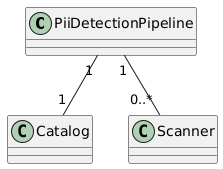

# 🔍 Detect PII

Detect PII is a library inspired by [piicatcher](https://github.com/tokern/piicatcher) and [CommonRegex](https://github.com/madisonmay/CommonRegex) to detect columns in tables that may potentially contain PII. It does so by performing regex matches 
on column names and column values, flagging the ones that may contain PII.

## Usage

### Check the table schema and values for PII columns
```python
from detectpii.catalog import PostgresCatalog
from detectpii.pipeline import PiiDetectionPipeline
from detectpii.scanner import DataScanner, MetadataScanner

# -- Create a catalog to connect to a database / warehouse
pg_catalog = PostgresCatalog(
    host="localhost",
    user="postgres",
    password="my-secret-pw",
    database="postgres",
    port=5432,
    schema="public"
)

# -- Create a pipeline to detect PII in the tables
pipeline = PiiDetectionPipeline(
    catalog=pg_catalog,
    scanners=[
        MetadataScanner(),
        DataScanner(percentage=20, times=2,),
    ]
)

# -- Scan for PII columns.
pii_columns = pipeline.scan()
```

### Persist the pipeline

```python
import json
from detectpii.pipeline import pipeline_to_dict

# -- Create a pipeline
pipeline = ...

# -- Convert it into a dictionary
dictionary = pipeline_to_dict(pipeline)

# -- Print it
print(json.dumps(dictionary, indent=4))

# {
#     "catalog": {
#         "tables": [],
#         "user": "admin",
#         "password": "",
#         "host": "localhost",
#         "port": 9080,
#         "catalog": "hive",
#         "schema": "views",
#         "_type": "TrinoCatalog"
#     },
#     "scanners": [
#         {
#             "_type": "MetadataScanner"
#         },
#         {
#             "times": 2,
#             "percentage": 20,
#             "_type": "DataScanner"
#         }
#     ]
# }
```

### Load the pipeline

```python
from detectpii.pipeline import dict_to_pipeline

# -- Load the persisted pipeline as a dictionary
dictionary: dict = ...

# -- Convert it back to a pipeline object
pipeline = dict_to_pipeline(dictionary=dictionary)
```


## Extending the library



The library consists of three main components -- the `PiiDetectionPipeline`, the `Scanner`s, and `Catalog`s. Their relationship is shown in the diagram above. 
A pipeline consists of a catalog, which describes the table and columns, and scanners, which scan the tables and columns. 
The two scanners that the library ships with scan the column name and column values using regular expressions. These are built on top of piicatcher and CommonRegex. 
To add more catalogs and scanners, simply inherit from the `Catalog` and `Scanner` class, and implement the appropriate methods.

## Supported databases / warehouses  

* Postgres
* Trino
